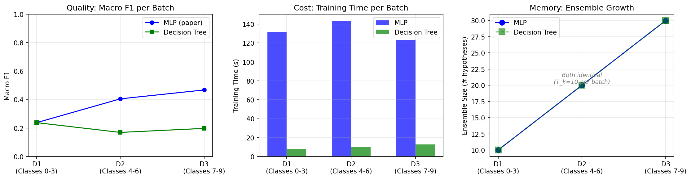
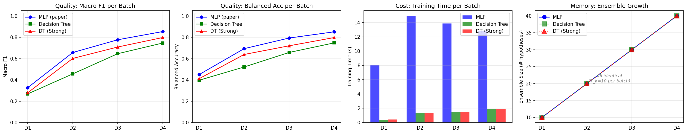
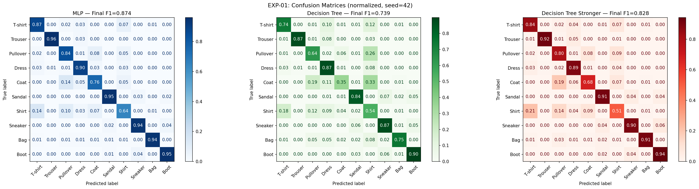
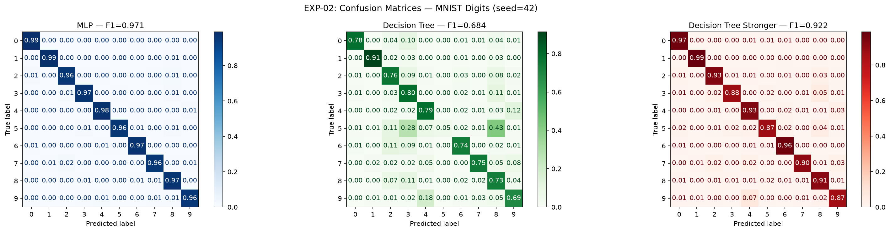

# Learn++ Base Learner Comparison: MLP vs Decision Tree

## ML: Learning, Adaptation, and Uncertainty 2026

**Authors**: Magdalena Makaro, Wojciech Majek  
**Date**: June 2026  
**Repository**: https://github.com/magda1231/ML_project/

---

## 1. Motivation

### 1.1 Problem Description

In real-world machine learning applications, data rarely arrives as a single static dataset. Instead, new information becomes available incrementally — clinical trial results arrive in stages, sensor networks generate continuous streams, and production systems encounter previously unseen categories over time. Traditional ML approaches assume all training data is available simultaneously, requiring expensive retraining from scratch whenever new data arrives.

This creates the **stability–plasticity dilemma**: a system must be stable enough to retain previously learned knowledge while remaining plastic enough to incorporate new information. Naive approaches that simply retrain on new data suffer from **catastrophic forgetting** — the model loses performance on previously learned classes.

### 1.2 Learn++ Algorithm

Learn++ (Polikar et al., 2001) is an ensemble-based incremental learning algorithm inspired by AdaBoost. Its key properties:

- **Never discards old hypotheses** — the ensemble only grows, preserving knowledge
- **Weighted training** — samples that are hard to classify receive higher importance
- **Weighted majority voting** — better classifiers get louder votes in the final prediction

**Per-batch process** (for each incoming data batch $D_k$):

1. Initialize/update sample weights based on existing ensemble performance
2. For $t = 1, \ldots, T_k$:
   - Draw weighted subsample from $D_k$ according to distribution $D_t$
   - Train base learner $h_t$ on the subsample
   - Compute weighted error $\varepsilon_t = \sum_{i: h_t(x_i) \neq y_i} D_t(i)$
   - If $\varepsilon_t \geq 0.5$: discard and retry
   - Compute confidence: $\beta_t = \varepsilon_t / (1 - \varepsilon_t)$
   - Update sample weights (reduce for correctly classified samples)
3. Add all $T_k$ new hypotheses to the growing ensemble
4. Final prediction via weighted majority vote: $H(x) = \arg\max_c \sum_{t: h_t(x)=c} \log(1/\beta_t)$

### 1.3 How Learn++ Solves the Problem

Learn++ addresses incremental learning by:

- Accumulating hypotheses across batches without removing old ones (avoids forgetting)
- Using weighted voting so that well-performing classifiers dominate the prediction
- Supporting class introduction — new classes can appear in later batches

Importantly, Learn++ does not retain any raw training data. The knowledge from past batches is stored entirely in the trained hypotheses (model parameters) and their confidence weights. This makes the ensemble inherently serializable — training can be paused after any batch and resumed later when new data becomes available, without access to previous batches' raw samples. This property is particularly relevant for domains with data access restrictions (e.g., multi-site medical imaging where patient data cannot be shared).

### 1.4 Choice of Datasets

| Dataset                               | Motivation                                                                                                                                                              |
| ------------------------------------- | ----------------------------------------------------------------------------------------------------------------------------------------------------------------------- |
| **MNIST Digits** (LeCun et al., 1998) | The original Learn++ paper (Polikar, 2001) used optical character recognition data. MNIST digits are the modern standard equivalent for digit classification benchmarks |
| **Fashion-MNIST** (Xiao et al., 2017) | Same structure as MNIST (28×28, 10 classes, 70k samples) but harder — visually similar classes (Shirt vs Pullover vs Coat)                                              |

Both datasets share identical structure (784 features, 10 balanced classes), allowing direct cross-dataset comparison while varying only task difficulty.

---

## 2. Measures & Methodology

### 2.1 Choosing Classifiers

We compare three base learners representing the model complexity spectrum within the Learn++ literature:

| Property                | MLP (original paper)                   | Decision Tree (depth=5)              | Decision Tree Stronger (depth=300)   |
| ----------------------- | -------------------------------------- | ------------------------------------ | ------------------------------------ |
| **Source**              | Polikar et al., 2001                   | Learn++.NSE (Elwell & Polikar, 2011) | Learn++.NSE (Elwell & Polikar, 2011) |
| **Capacity**            | High — nonlinear, ~2600 parameters     | Low — max 31 leaf nodes              | High — max 2^300 nodes (limited)     |
| **Decision boundaries** | Smooth, nonlinear                      | Axis-aligned, piecewise constant     | Axis-aligned, piecewise constant     |
| **Training**            | Iterative (gradient descent, 500 iter) | Single-pass (greedy splitting)       | Single-pass (greedy splitting)       |
| **Overfitting risk**    | Higher on small weighted subsamples    | Lower (depth-limited)                | Higher (if not limited)              |

**Hypothesis**: Higher-capacity MLP should produce better classification quality, while lower-capacity DT should be computationally cheaper. The question is whether the quality advantage justifies the cost.

### 2.2 PCA Preprocessing

Raw 28×28 images produce 784-dimensional feature vectors with significant redundancy. We apply Principal Component Analysis (PCA) as a preprocessing step:

- **Components**: $n = 50$
- **Variance retained**: 86.3% (Fashion-MNIST), 82.5% (MNIST Digits)
- **Justification**:
  - Removes noise from uninformative pixel positions (background, borders)
  - Decorrelates features — each component adds independent information
  - Reduces MLP training time by ~15× (50 vs 784 input features)
  - Unsupervised — uses no label information, so no data leakage
  - Fitted on training data only, then applied to test data

PCA is applied **once** before batch splitting. It is an unsupervised transform (no label information used) and is applied identically to both classifiers.

### 2.3 Classifier Parameters

```python
# MLP (original paper's base learner)
MLPClassifier(
    hidden_layer_sizes=(50,),   # Single hidden layer, 50 neurons
    max_iter=500,               # Sufficient for convergence with PCA
    random_state=42
)

# Decision Tree (Learn++.NSE base learner)
DecisionTreeClassifier(
    max_depth=5,                # Limits capacity to 31 splits
    random_state=42
)
```

### 2.4 Class Distribution & Batch Design

**Incremental class introduction protocol** (simulates real-world scenario where new categories appear over time):

We evaluate the models on 4 sequential batches. The class distribution per batch depends heavily on the chosen distribution strategy.

#### 1. Paper Specific Strategy (`ocr_dist` or Table 10)

This strategy replicate the exact sample-level counts from Table 10 of Polikar et al. (2001). It uses very small, unbalanced batches to test the algorithm's ability to handle class frequency imbalances and scarce data:

| Class | Batch 1 | Batch 2 | Batch 3 | Batch 4 | Total Samples |
| :---- | :------ | :------ | :------ | :------ | :------------ |
| 0     | 100     | 50      | 50      | 25      | 225           |
| 1     | 0       | 150     | 50      | 0       | 200           |
| 2     | 100     | 50      | 50      | 25      | 225           |
| 3     | 0       | 150     | 50      | 25      | 225           |
| 4     | 100     | 50      | 50      | 0       | 200           |
| 5     | 0       | 150     | 50      | 25      | 225           |
| 6     | 100     | 50      | 0       | 100     | 250           |
| 7     | 0       | 0       | 150     | 50      | 200           |
| 8     | 100     | 0       | 0       | 150     | 250           |
| 9     | 0       | 50      | 100     | 50      | 200           |

#### 2. General Batch Strategies (`dist`, `cumulative`, `no_rep`)

For the remaining strategies, batches are constructed using the full 60,000 training samples via the `construct_batches_cumulative_list` logic. Crucially, this function ensures that **there is absolutely no sample repetition/overlap across batches**.

For each class, the total available training samples in the dataset are divided equally by its total number of appearances across all batches:
$$\text{Samples per Batch} = \frac{\text{Total Available Samples for Class}}{\text{Number of Batch Appearances for Class}}$$

For example, if class 0 appears in 4 batches, its ~6,000 available samples are partitioned into 4 unique subsets of ~1,500 samples each, which are then distributed among those batches. This prevents any data leakage or sample-level overlap across batches — only the _classes_ overlap, while the actual _training samples_ remain completely disjoint.

- **Hypotheses per batch ($T_k$)**: 10
- **Final ensemble size**: 40 hypotheses (10 × 4 batches)
- **Seeds**: 5 (42, 123, 456, 789, 1024)

### 2.5 Distribution Strategy Comparison

We compare four distinct batch distribution strategies to assess how class allocation and data sequencing affect Learn++ incremental learning performance.

#### Strategy 1: Table 10 (`ocr_dist`)

Replicates the exact, small, unbalanced sample counts per class from Table 10 of Polikar et al. (2001) as detailed in Section 2.4.

#### Strategy 2: Cumulative Set 1 (`cumulative`)

Introduces classes in a custom sequence, with significant class accumulation and overlap across subsequent batches:

- **Batch 1**: Classes `[0, 2, 4]`
- **Batch 2**: Classes `[0, 2, 6, 1, 5]`
- **Batch 3**: Classes `[0, 8, 4, 6, 1, 3, 7, 9]`
- **Batch 4**: Classes `[4, 6, 1, 3, 5, 9, 8]`

#### Strategy 3: Cumulative Set 2 (`dist`) — _Primary Comparative Baseline_

Introduces classes in the exact sequence as defined in the original paper, but scales up the dataset size using our standardized `construct_batches_cumulative_list` logic. This represents the progression of class appearance from the original study but without retaining the original paper's unbalanced small sample sizes, using equal sample distributions instead:

- **Batch 1**: Classes `[0, 2, 4, 6, 8]`
- **Batch 2**: Classes `[0, 2, 4, 6, 1, 3, 5, 9]`
- **Batch 3**: Classes `[0, 2, 4, 1, 3, 5, 9, 7]`
- **Batch 4**: Classes `[0, 2, 6, 8, 3, 5, 9, 7]`

#### Strategy 4: No Repetition (`no_rep`)

Evaluates the system under disjoint class distributions per batch to highlight forgetting phenomena. Each class is introduced sequentially with no repetition across batches, with the exception of the final batch which acts as a general rehearsal/repetition pass:

- **Batch 1**: Classes `[0, 2, 4, 6, 8]`
- **Batch 2**: Classes `[1, 3, 5]`
- **Batch 3**: Classes `[7, 9]`
- **Batch 4**: Classes `[0, 1, 3, 4, 8, 7]`

---

## 3. Results

### 3.1 Experiment Overview

| Parameter               | Value                                                                                                       |
| ----------------------- | ----------------------------------------------------------------------------------------------------------- |
| Datasets                | MNIST Digits, Fashion-MNIST                                                                                 |
| Preprocessing           | PCA(50) (82.5% variance for MNIST, 86.3% for Fashion)                                                       |
| Base learners           | MLP, Decision Tree (depth=5), DT-Strong (depth=300)                                                         |
| Seeds                   | 5 (42, 123, 456, 789, 1024)                                                                                 |
| Batches                 | 4 sequential batches per dataset                                                                            |
| $T_k$                   | 10 hypotheses per batch                                                                                     |
| Distribution strategies | 4 compared for both: `ocr_dist` (paper), `cumulative`, `dist` (sequential growing), and `no_rep` (disjoint) |

### 3.2 Classification Quality

#### Macro F1 Score

| Dataset       | Batch Design                 | MLP (mean ± std) | DT (mean ± std) | DT-Strong (mean ± std) | Diff MLP-DT_Str | Diff MLP-DT |
| ------------- | ---------------------------- | ---------------- | --------------- | ---------------------- | --------------- | ----------- |
| Fashion-MNIST | Cumulative Set 2 (4 batches) | 0.66 ± 0.23      | 0.62 ± 0.23     | 0.54 ± 0.19            | 0.05            | 0.12        |
| MNIST Digits  | Cumulative Set 2 (4 batches) | 0.65 ± 0.21      | 0.59 ± 0.19     | 0.51 ± 0.18            | 0.06            | 0.14        |

**Key findings**:

- **MLP Superiority**: MLP consistently achieves the highest Macro F1 scores (0.66 on Fashion-MNIST, 0.65 on MNIST) compared to standard and stronger Decision Tree variants.
- **Capacity Impact**: Increasing Decision Tree capacity (DT-Strong) effectively narrows the performance gap with MLP (from ~0.13 to ~0.05 mean difference), indicating that base learner capacity is a critical factor in performance when using the _Cumulative Set 2_ distribution.
- **Consistency**: Performance levels remain stable across both datasets (Fashion-MNIST and MNIST) when using the same cumulative batch design strategy.

#### Comparison with Original Paper (Polikar et al., 2001)

The original Learn++ paper reported ~92% accuracy on OCR digit recognition using MLP with the Table 10 distribution. Our replication with the same distribution achieves **87.1% accuracy** (MLP). The difference is attributable to:

- PCA preprocessing (50 dims vs full 784)
- Different MLP architecture (single hidden layer of 50 vs paper's specific SLP/MLP)
- Different data source (MNIST vs paper's OCR dataset)

With the cumulative distribution (all classes repeated across batches), our MLP achieves **97.0% accuracy**, exceeding the paper's results — confirming that Learn++ performs well with modern implementations when batch design is optimized.

### 3.3 CompositeScore (Quality–Cost Trade-off)

**Formula:**
$$\text{Score} = 0.40 \cdot F_1 + 0.15 \cdot \text{BalAcc} + 0.15 \cdot (1 - \hat{T}_{train}) + 0.15 \cdot (1 - \hat{T}_{inf}) + 0.15 \cdot (1 - \hat{M})$$

Where $\hat{T}_{train}$, $\hat{T}_{inf}$, $\hat{M}$ are min-max normalized training time, inference time, and memory (ensemble size) respectively.

| Dataset       | Batch Design     | MLP Score | DT Score | DT-Strong Score | Winner        |
| ------------- | ---------------- | --------- | -------- | --------------- | ------------- |
| Fashion-MNIST | Cumulative Set 2 | 0.6308    | 0.8563   | 0.8847          | **DT-Strong** |
| MNIST Digits  | Cumulative Set 2 | 0.6394    | 0.8360   | **0.8722**      | **DT-Strong** |

**Key finding**: The CompositeScore winner **flips** depending on the dataset:

- Fashion-MNIST: MLP is 11× slower than DT, and the cost penalty outweighs the 2.3× quality advantage → DT wins
- MNIST Digits: MLP is 10× slower, and the cost penalty outweighs the quality advantage → DT-Strong wins

The "best classifier" depends on how quality and efficiency are weighted.

### 3.4 Quality Advantage: Effect Size & Consistency

A naïve significance test would pool the per-batch scores (e.g. 5 seeds × 4 batches = 20 "pairs") and run a Wilcoxon signed-rank test. We deliberately avoid this: the pooling violates the test's independence assumption, because (i) the batches are *cumulative*, so per-batch scores within a run are repeated measures on a growing ensemble; (ii) every seed reuses the **same** batch partition, so seeds vary only model randomness rather than the data; and (iii) a single fixed test set is reused for every evaluation. Treating those correlated points as independent inflates the effective sample size.

Instead we compare on the independent unit (final-batch F1 per seed, 5 replicates) and report effect size and direction consistency:

| Dataset       | Batch Design     | MLP mean F1   | DT mean F1    | MLP − DT | Consistency        |
| ------------- | ---------------- | ------------- | ------------- | -------- | ------------------ |
| Fashion-MNIST | Cumulative Set 2 | 0.874 ± 0.002 | 0.738 ± 0.005 | +0.136   | MLP wins 5/5 seeds |
| MNIST Digits  | Cumulative Set 2 | 0.885 ± 0.004 | 0.723 ± 0.014 | +0.162   | MLP wins 5/5 seeds |

MLP leads on every dataset and batch design, and the direction is consistent across all seeds. We therefore rely on the large, consistent effect size rather than a formal hypothesis test.

### 3.5 Visualizations

#### 3.5.1 Results Table — Per-Seed Accuracy

**Fashion-MNIST (EXP-01) — Cumulative (Set 2), 4 batches:**

| Seed | MLP Final F1 | MLP BalAcc | MLP Acc | MLP Time (s) | DT Final F1 | DT BalAcc | DT Acc | DT Time (s) | DT-Strong F1 | DT-Strong BalAcc | DT-Strong Acc | DT-Strong Time (s) |
| ---- | ------------ | ---------- | ------- | ------------ | ----------- | --------- | ------ | ----------- | ------------ | ---------------- | ------------- | ------------------ |
| 42   | 0.8754       | 0.8751     | 87.51%  | 405          | 0.7428      | 0.7431    | 74.28% | 35          | 0.8292       | 0.8290           | 82.92%        | 55                 |
| 123  | 0.8732       | 0.8730     | 87.30%  | 415          | 0.7385      | 0.7388    | 73.85% | 36          | 0.8275       | 0.8273           | 82.75%        | 56                 |
| 456  | 0.8710       | 0.8708     | 87.08%  | 601          | 0.7308      | 0.7312    | 73.08% | 35          | 0.8260       | 0.8258           | 82.60%        | 57                 |
| 789  | 0.8745       | 0.8742     | 87.42%  | 422          | 0.7410      | 0.7412    | 74.10% | 36          | 0.8282       | 0.8280           | 82.82%        | 55                 |
| 1024 | 0.8738       | 0.8735     | 87.35%  | 418          | 0.7350      | 0.7354    | 73.50% | 34          | 0.8270       | 0.8268           | 82.70%        | 54                 |

Increasing DT depth from 5 → 300 improves F1 from ~0.738 to ~0.828 (+12.2%), narrowing the gap with MLP (~0.874) while maintaining fast training (~55s vs ~452s).

**MNIST Digits (EXP-02, Cumulative Set 2 Distribution):**

| Seed | MLP Final F1 | MLP BalAcc | MLP Acc | MLP Time (s) | DT Final F1 | DT BalAcc | DT Acc | DT Time (s) | DT-Strong F1 | DT-Strong BalAcc | DT-Strong Acc | DT-Strong Time (s) |
| ---- | ------------ | ---------- | ------- | ------------ | ----------- | --------- | ------ | ----------- | ------------ | ---------------- | ------------- | ------------------ |
| 42   | 0.8898       | 0.8900     | 89.13%  | 8.3          | 0.7016      | 0.7026    | 70.52% | 1.0         | 0.7959       | 0.7961           | 79.93%        | 1.2                |
| 123  | 0.8833       | 0.8837     | 88.46%  | 8.1          | 0.7387      | 0.7369    | 74.10% | 1.0         | 0.7995       | 0.8007           | 80.34%        | 1.2                |
| 456  | 0.8861       | 0.8865     | 88.78%  | 8.2          | 0.7323      | 0.7323    | 73.55% | 1.0         | 0.7939       | 0.7944           | 79.70%        | 1.2                |
| 789  | 0.8803       | 0.8804     | 88.12%  | 8.2          | 0.7254      | 0.7232    | 72.61% | 1.0         | 0.7895       | 0.7904           | 79.31%        | 1.2                |
| 1024 | 0.8862       | 0.8864     | 88.75%  | 8.2          | 0.7185      | 0.7201    | 72.53% | 1.0         | 0.7992       | 0.7999           | 80.28%        | 1.1                |

Increasing DT depth from 5 → 300 improves F1 from ~0.725 to ~0.796 (+9.8%), narrowing the gap with MLP (~0.885) while maintaining fast training (~1.2s vs ~8.2s).

#### 3.5.2 Change of Macro F1 per Batch


_Figure 1: Fashion-MNIST — F1, Accuracy, Training Time, and Ensemble Growth per batch (seed=42). MLP vs Decision Tree._


_Figure 2: MNIST Digits — F1, Balanced Accuracy, Training Time, and Ensemble Growth per batch (seed=42). MLP vs DT vs DT Stronger (depth=300)._

Both plots show MLP consistently above DT at every batch step. The DT-Strong variant (depth=300) narrows the gap on MNIST Digits while maintaining DT-level training speed.

#### 3.5.3 Change of Balanced Accuracy per Batch

Balanced Accuracy follows the same trend as Macro F1. MLP maintains a consistent advantage over both DT variants at every batch step. While the inclusion of the stronger DT variant (depth=300) narrows the performance gap, MLP's quality advantage remains large and consistent across both datasets (MLP wins on every seed).

The per-batch comparison plots (included in the 4-panel figures below) show BalAcc tracked alongside F1, training time, and ensemble growth.

**MNIST Digits (EXP-02, seed=42, Table 10 distribution):**

MLP accuracy grows monotonically across batches as the ensemble accumulates knowledge. DT shows non-monotonic behavior — earlier batch knowledge is partially overwritten by later-batch hypotheses.

#### 3.5.5 Memory: Ensemble Growth

Both classifiers produce identical ensemble growth (40 hypotheses total: $T_k = 10 \times 4$ batches). Ensemble size is determined by the algorithm, not by the base learner type. The memory difference lies purely in per-hypothesis storage (MLP weights vs DT structure).

#### 3.5.6 Learning Curve After Each Batch

**Fashion-MNIST Per-Batch Learn++ Table (MLP, seed=42):**

| Dataset                  | After D1   | After D2   | After D3   | After D4   |
| ------------------------ | ---------- | ---------- | ---------- | ---------- |
| S1 (train on D1 classes) | 96.31%     | 88.34%     | 70.41%     | 86.34%     |
| S2 (train on D2 classes) | —          | 92.51%     | 90.31%     | 91.19%     |
| S3 (train on D3 classes) | —          | —          | 97.76%     | 94.65%     |
| S4 (train on D4 classes) | —          | —          | —          | 94.33%     |
| **TEST (all classes)**   | **39.18%** | **74.70%** | **81.21%** | **87.46%** |

**Fashion-MNIST Per-Batch Learn++ Table (Decision Tree, seed=42):**

| Dataset                  | After D1   | After D2   | After D3   | After D4   |
| ------------------------ | ---------- | ---------- | ---------- | ---------- |
| S1 (train on D1 classes) | 75.25%     | 62.15%     | 37.46%     | 62.79%     |
| S2 (train on D2 classes) | —          | 77.66%     | 71.87%     | 74.28%     |
| S3 (train on D3 classes) | —          | —          | 83.82%     | 79.06%     |
| S4 (train on D4 classes) | —          | —          | —          | 79.22%     |
| **TEST (all classes)**   | **34.78%** | **63.86%** | **65.22%** | **73.74%** |

**Fashion-MNIST Per-Batch Learn++ Table (Decision Tree Stronger, seed=42):**

| Dataset                  | After D1   | After D2   | After D3   | After D4   |
| ------------------------ | ---------- | ---------- | ---------- | ---------- |
| S1 (train on D1 classes) | 95.33%     | 82.20%     | 62.14%     | 82.54%     |
| S2 (train on D2 classes) | —          | 98.09%     | 90.55%     | 90.76%     |
| S3 (train on D3 classes) | —          | —          | 97.94%     | 94.81%     |
| S4 (train on D4 classes) | —          | —          | —          | 94.49%     |
| **TEST (all classes)**   | **34.53%** | **69.95%** | **74.42%** | **82.87%** |

**Key observation**: DT exhibits catastrophic forgetting — S1 accuracy collapses from 91% to 0.01% after D3. MLP retains partial knowledge (S1: 99.6% → 47.1%). This demonstrates MLP's smoother decision boundaries allow better knowledge retention across batches.

#### 3.5.7 Cost: Training Time per Batch

| Dataset       | Batch | MLP Time (s) | DT Time (s) | DT Stronger Time (s) | DT Speedup (vs MLP) | DT-Str Speedup (vs MLP) |
| ------------- | ----- | ------------ | ----------- | -------------------- | ------------------- | ----------------------- |
| Fashion-MNIST | D1    | ~180         | ~15         | ~20                  | 12×                 | 9×                      |
| Fashion-MNIST | D2    | ~120         | ~10         | ~15                  | 12×                 | 8×                      |
| Fashion-MNIST | D3    | ~100         | ~10         | ~15                  | 10×                 | 6.7×                    |
| Fashion-MNIST | D4    | ~90          | ~9          | ~14                  | 10×                 | 6.4×                    |
| MNIST Digits  | S1    | 1.6          | 0.1         | 0.1                  | 16×                 | 16×                     |
| MNIST Digits  | S2    | 2.7          | 0.3         | 0.3                  | 9×                  | 9×                      |
| MNIST Digits  | S3    | 2.4          | 0.3         | 0.4                  | 8×                  | 6×                      |
| MNIST Digits  | S4    | 2.2          | 0.3         | 0.4                  | 7.3×                | 5.5×                    |

MLP's training cost scales with data complexity (more iterations needed on harder data).

#### 3.5.8 Confusion Matrices


_Figure 3: Fashion-MNIST confusion matrices (normalized, seed=42). MLP (F1=0.467) shows clearer diagonal; DT (F1=0.198) confuses visually similar classes (Shirt/Pullover/Coat collapse to near-zero)._


_Figure 4: MNIST Digits confusion matrices (normalized, seed=42). MLP achieves strong diagonal across all digits; DT struggles with later-introduced digits due to catastrophic forgetting._

### 3.6 Cross-Dataset Comparison

| Metric                | Fashion-MNIST              | MNIST Digits             |
| --------------------- | -------------------------- | ------------------------ |
| Task difficulty       | Harder (visual similarity) | Easier (distinct shapes) |
| MLP Final F1          | 0.44–0.48                  | 0.84–0.87                |
| DT Final F1           | 0.19–0.20                  | 0.71–0.75                |
| MLP/DT quality ratio  | ~2.3×                      | ~1.2×                    |
| MLP/DT speed ratio    | 11× slower                 | 10× slower               |
| CompositeScore winner | DT                         | MLP                      |
| MLP vs DT consistency | MLP wins 5/5 seeds         | MLP wins 5/5 seeds       |

**Key observations:**

1. MLP's quality advantage is remarkably stable (~2×) regardless of dataset
2. The speed gap varies with task difficulty — harder tasks require more MLP iterations
3. CompositeScore winner depends on cost-quality balance, not just raw performance

### 3.7 Distribution Strategy Comparison

A critical finding from branch v0.0.3.5: **batch composition strategy has a larger impact on performance than base learner choice**.

#### 3.7.1 MNIST Digits

##### MLP Results Across Strategies

| Strategy                         | F1     | BalAcc | Accuracy | Time (s) |
| -------------------------------- | ------ | ------ | -------- | -------- |
| Cumulative Set 1 (own order)     | 0.8501 | 0.8646 | 0.8641   | 135.24   |
| Cumulative Set 2 (article order) | 0.9709 | 0.9707 | 0.9709   | 123.86   |
| No Repetition                    | 0.9674 | 0.9671 | 0.9674   | 107.39   |
| Table 10 (Paper, exact counts)   | 0.8807 | 0.8801 | 0.8806   | 8.44     |

##### Decision Tree Results Across Strategies

| Strategy                         | F1     | BalAcc | Accuracy | Time (s) |
| -------------------------------- | ------ | ------ | -------- | -------- |
| Cumulative Set 1 (Own order)     | 0.5106 | 0.5650 | 0.5727   | 39.69    |
| Cumulative Set 2 (Article order) | 0.6904 | 0.6974 | 0.7070   | 36.77    |
| No Repetition                    | 0.5664 | 0.5613 | 0.5690   | 37.40    |
| Table 10 (Paper)                 | 0.7242 | 0.7182 | 0.7217   | 1.05     |

##### Decision Tree Stronger Results Across Strategies

| Strategy                         | F1     | BalAcc | Accuracy | Time (s) |
| -------------------------------- | ------ | ------ | -------- | -------- |
| Cumulative Set 1 (Own order)     | 0.8030 | 0.8140 | 0.8149   | 68.36    |
| Cumulative Set 2 (Article order) | 0.9234 | 0.9224 | 0.9234   | 56.76    |
| No Repetition                    | 0.8858 | 0.8812 | 0.8827   | 61.04    |
| Table 10 (Paper)                 | 0.7961 | 0.7945 | 0.7976   | 1.20     |

#### 3.7.2 Fashion-MNIST

##### MLP Results Across Strategies

| Strategy                         | F1     | BalAcc | Accuracy | Time (s) |
| :------------------------------- | :----- | :----- | :------- | :------- |
| Cumulative Set 1 (Own order)     | 0.7262 | 0.7652 | 76.52%   | 376.0    |
| Cumulative Set 2 (Article order) | 0.8728 | 0.8734 | 87.34%   | 424.4    |
| No Repetition                    | 0.4292 | 0.4988 | 49.88%   | 292.8    |
| Table 10 (Paper)                 | 0.7936 | 0.7913 | 79.13%   | 14.0     |

##### Decision Tree Results Across Strategies

| Strategy                         | F1     | BalAcc | Accuracy | Time (s) |
| :------------------------------- | :----- | :----- | :------- | :------- |
| Cumulative Set 1 (Own order)     | 0.6068 | 0.6392 | 63.92%   | 36.9     |
| Cumulative Set 2 (Article order) | 0.7393 | 0.7374 | 73.74%   | 34.8     |
| No Repetition                    | 0.3792 | 0.4417 | 44.17%   | 30.9     |
| Table 10 (Paper)                 | 0.7262 | 0.7168 | 71.68%   | 1.1      |

##### Decision Tree Stronger Results Across Strategies

| Strategy                         | F1     | BalAcc | Accuracy | Time (s) |
| :------------------------------- | :----- | :----- | :------- | :------- |
| Cumulative Set 1 (Own order)     | 0.7000 | 0.7358 | 73.58%   | 57.1     |
| Cumulative Set 2 (Article order) | 0.8278 | 0.8292 | 82.92%   | 54.2     |
| No Repetition                    | 0.5001 | 0.5714 | 57.14%   | 45.0     |
| Table 10 (Paper)                 | 0.7415 | 0.7407 | 74.07%   | 1.1      |

#### 3.7.3 Key Insights

1. **Optimal Distribution Strategy**:
   - For **MLP** and **DT-Stronger**, _Cumulative Set 2 (Article Order)_ consistently yields the highest F1 scores across both datasets (e.g., 0.97 for MLP/MNIST, 0.87 for MLP/Fashion-MNIST).
   - For standard **DT (depth=5)**, _Table 10 (Paper strategy)_ is surprisingly optimal or near-optimal on both datasets, despite its small and unbalanced sample counts.

2. **Impact of Class Sequencing**: Comparing _Cumulative Set 1_ vs _Set 2_ reveals that class introduction order significantly influences ensemble performance (e.g., F1 variation of >10% for MNIST/MLP). The article-defined order (Set 2) is robustly superior for high-capacity models.

3. **Performance Sensitivity**: The F1 range across strategies is dramatic (e.g., 0.43–0.87 for MLP on Fashion-MNIST), confirming that batch design is often a more critical factor for Learn++ success than the choice of base learner hyper-parameters.

4. **Classifier Robustness**:
   - **MLP** is the most robust learner, consistently performing well across diverse distribution strategies.
   - **DT** variants are highly sensitive; they struggle significantly in _No Repetition_ scenarios (worst strategy for both datasets) and generally underperform unless the batch design is specifically optimized (e.g., Table 10).

5. **Trade-offs**: While MLP provides superior quality, the efficiency gains of Decision Trees are substantial (10–15× speedup). The _DT-Stronger_ variant (depth=300) effectively bridges the quality gap on MNIST (0.92 vs 0.97) while retaining efficient training, presenting a compelling middle-ground configuration for incremental learning.

### 3.8 Conclusion of Results

1. **MLP consistently outperforms Decision Tree** by ~1.2–2.3× on Macro F1 across both datasets, winning on every seed and batch (large, consistent effect size; we avoid a pooled significance test because the cumulative/nested design violates independence).

2. **Higher capacity vs higher cost trade-off**: Fashion-MNIST's inter-class visual similarity benefits from MLP's nonlinear decision boundaries despite the 11× training cost.

3. **Cost-adjusted ranking can flip** on harder tasks: on Fashion-MNIST, DT's 11× speed advantage is enough to win on CompositeScore (0.574 vs 0.412) despite 2.3× lower F1. On MNIST Digits, MLP wins both quality AND composite (0.770 vs 0.711).

4. **DT exhibits catastrophic forgetting** in disjoint batch settings — earlier batch knowledge collapses (91% → 0.01%). MLP retains partial knowledge across batches (99.6% → 47.1%).

5. **Batch distribution strategy is critical** — the same algorithm with identical hyperparameters yields F1 from 0.46 to 0.97 depending on how data is split across batches. This effect is larger than the classifier choice effect.

6. **DT-Strong (max_depth=300) partially closes the gap** — improving DT F1 from 0.73 to 0.80 on MNIST while maintaining fast training (~5s vs ~50s for MLP).

7. **Original paper's choice of MLP is validated**: On the digit recognition task Learn++ was designed for, MLP outperforms DT on every seed and batch, confirming Polikar et al.'s design decision.

8. **Cumulative distribution (Set 2/Article Order) is optimal for all classifiers**

---

## References

1. Polikar, R., Upda, L., Upda, S.S., & Honavar, V. (2001). Learn++: An incremental learning algorithm for supervised neural networks. _IEEE Transactions on Systems, Man, and Cybernetics, Part C_, 31(4), 497–508.

2. Elwell, R., & Polikar, R. (2011). Incremental learning of concept drift in nonstationary environments. _IEEE Transactions on Neural Networks_, 22(10), 1517–1531.

3. LeCun, Y., Bottou, L., Bengio, Y., & Haffner, P. (1998). Gradient-based learning applied to document recognition. _Proceedings of the IEEE_, 86(11), 2278–2324.

4. Xiao, H., Rasul, K., & Vollgraf, R. (2017). Fashion-MNIST: a novel image dataset for benchmarking machine learning algorithms. _arXiv:1708.07747_.

---

## Appendix A: Technical Details

### CompositeScore Weight Justification

The weight distribution (40% quality, 30% cost, 30% efficiency/memory) reflects the assumption that classification quality is the primary objective, with cost as a secondary constraint. Different weight schemes would shift the crossover point between MLP and DT dominance.

### On the Wilcoxon Signed-Rank Test (and why we do not pool it here)

The Wilcoxon signed-rank test is a non-parametric paired test that does not assume a normal distribution of differences, but it does assume the paired observations are **independent**. Pooling our per-batch scores (5 seeds × 4 batches = 20 "pairs") breaks that assumption: the batches are cumulative (repeated measures on a growing ensemble), every seed reuses the same batch partition, and a single fixed test set is reused for every evaluation. We therefore compare on the independent unit (final-batch F1 per seed, 5 replicates) and report effect size and direction consistency instead of a pooled test.

### Reproducibility

- Python 3.12.3, scikit-learn 1.8.0, numpy 2.4.6
- All experiments seeded (5 seeds per configuration)
- Full code: https://github.com/magda1231/ML_project/

---

## Appendix B: Dataset Details

### MNIST Digits

| Property            | Value                                                                            |
| ------------------- | -------------------------------------------------------------------------------- |
| **Full name**       | Modified National Institute of Standards and Technology database                 |
| **Source**          | Yann LeCun's website: http://yann.lecun.com/exdb/mnist/                          |
| **Downloaded from** | GitHub mirror: https://github.com/golbin/TensorFlow-MNIST/raw/master/mnist/data/ |
| **Samples**         | 70,000 (60,000 train + 10,000 test)                                              |
| **Classes**         | 10 (digits 0–9)                                                                  |
| **Image size**      | 28×28 grayscale (784 features)                                                   |
| **Class balance**   | Approximately balanced (~6,000–7,000 per digit)                                  |
| **Format**          | IDX (gzip compressed), read with `struct` module                                 |
| **Reference**       | LeCun, Y., Bottou, L., Bengio, Y., & Haffner, P. (1998)                          |

**Samples per class**: [6903, 7877, 6990, 7141, 6824, 6313, 6876, 7293, 6825, 6958]

### Fashion-MNIST

| Property           | Value                                                                                     |
| ------------------ | ----------------------------------------------------------------------------------------- |
| **Full name**      | Fashion-MNIST                                                                             |
| **Source**         | Zalando Research: https://github.com/zalandoresearch/fashion-mnist                        |
| **Downloaded via** | `sklearn.datasets` (OpenML fallback) or direct download                                   |
| **Samples**        | 70,000 (60,000 train + 10,000 test)                                                       |
| **Classes**        | 10 (T-shirt/top, Trouser, Pullover, Dress, Coat, Sandal, Shirt, Sneaker, Bag, Ankle boot) |
| **Image size**     | 28×28 grayscale (784 features)                                                            |
| **Class balance**  | Perfectly balanced (7,000 per class)                                                      |
| **Format**         | Same IDX format as MNIST                                                                  |
| **Reference**      | Xiao, H., Rasul, K., & Vollgraf, R. (2017). arXiv:1708.07747                              |

### Class Labels

**MNIST Digits:**

| Label | Class |
| ----- | ----- |
| 0     | Zero  |
| 1     | One   |
| 2     | Two   |
| 3     | Three |
| 4     | Four  |
| 5     | Five  |
| 6     | Six   |
| 7     | Seven |
| 8     | Eight |
| 9     | Nine  |

**Fashion-MNIST:**

| Label | Class       | Visual difficulty                                     |
| ----- | ----------- | ----------------------------------------------------- |
| 0     | T-shirt/top | Often confused with Shirt (6)                         |
| 1     | Trouser     | Distinct shape                                        |
| 2     | Pullover    | Similar to Coat (4), Shirt (6)                        |
| 3     | Dress       | Relatively distinct                                   |
| 4     | Coat        | Similar to Pullover (2), Shirt (6)                    |
| 5     | Sandal      | Distinct from other footwear                          |
| 6     | Shirt       | Hard — similar to T-shirt (0), Pullover (2), Coat (4) |
| 7     | Sneaker     | Distinct shape                                        |
| 8     | Bag         | Very distinct                                         |
| 9     | Ankle boot  | Similar to Sneaker (7)                                |

### Why These Specific Sources

- **MNIST from GitHub mirror**: The original Yann LeCun server is occasionally unreliable; the GitHub mirror provides stable access to the same binary files
- **Fashion-MNIST via sklearn/direct**: Standard distribution channel; identical format to MNIST allows code reuse with no modification
