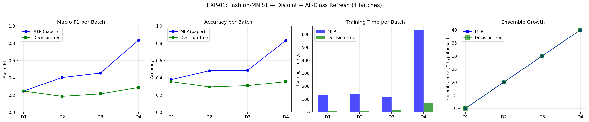

# Learn++ Base Learner Comparison: MLP vs Decision Tree
## ML: Learning, Adaptation, and Uncertainty 2026

**Authors**: Magdalena Makaro, Wojciech Majek  
**Date**: June 2026  
**Repository**: https://github.com/magda1231/ML_project/

---

## 1. Motivation

### 1.1 Problem Description

In real-world machine learning applications, data rarely arrives as a single static dataset. Instead, new information becomes available incrementally — clinical trial results arrive in stages, sensor networks generate continuous streams, and production systems encounter previously unseen categories over time. Traditional ML approaches assume all training data is available simultaneously, requiring expensive retraining from scratch whenever new data arrives.

This creates the **stability–plasticity dilemma**: a system must be stable enough to retain previously learned knowledge while remaining plastic enough to incorporate new information. Naive approaches that simply retrain on new data suffer from **catastrophic forgetting** — the model loses performance on previously learned classes.

### 1.2 Learn++ Algorithm

Learn++ (Polikar et al., 2001) is an ensemble-based incremental learning algorithm inspired by AdaBoost. Its key properties:

- **Never discards old hypotheses** — the ensemble only grows, preserving knowledge
- **Weighted training** — samples that are hard to classify receive higher importance
- **Weighted majority voting** — better classifiers get louder votes in the final prediction

**Per-batch process** (for each incoming data batch $D_k$):
1. Initialize/update sample weights based on existing ensemble performance
2. For $t = 1, \ldots, T_k$:
   - Draw weighted subsample from $D_k$ according to distribution $D_t$
   - Train base learner $h_t$ on the subsample
   - Compute weighted error $\varepsilon_t = \sum_{i: h_t(x_i) \neq y_i} D_t(i)$
   - If $\varepsilon_t \geq 0.5$: discard and retry
   - Compute confidence: $\beta_t = \varepsilon_t / (1 - \varepsilon_t)$
   - Update sample weights (reduce for correctly classified samples)
3. Add all $T_k$ new hypotheses to the growing ensemble
4. Final prediction via weighted majority vote: $H(x) = \arg\max_c \sum_{t: h_t(x)=c} \log(1/\beta_t)$

### 1.3 How Learn++ Solves the Problem

Learn++ addresses incremental learning by:
- Accumulating hypotheses across batches without removing old ones (avoids forgetting)
- Using weighted voting so that well-performing classifiers dominate the prediction
- Supporting class introduction — new classes can appear in later batches

Importantly, Learn++ does not retain any raw training data. The knowledge from past batches is stored entirely in the trained hypotheses (model parameters) and their confidence weights. This makes the ensemble inherently serializable — training can be paused after any batch and resumed later when new data becomes available, without access to previous batches' raw samples. This property is particularly relevant for domains with data access restrictions (e.g., multi-site medical imaging where patient data cannot be shared).

### 1.4 Choice of Datasets

| Dataset | Motivation |
|---------|-----------|
| **MNIST Digits** (LeCun et al., 1998) | The original Learn++ paper (Polikar, 2001) used optical character recognition data. MNIST digits are the modern standard equivalent for digit classification benchmarks |
| **Fashion-MNIST** (Xiao et al., 2017) | Same structure as MNIST (28×28, 10 classes, 70k samples) but harder — visually similar classes (Shirt vs Pullover vs Coat) |

Both datasets share identical structure (784 features, 10 balanced classes), allowing direct cross-dataset comparison while varying only task difficulty.

---

## 2. Measures & Methodology

### 2.1 Choosing Classifiers

We compare two base learners representing opposite ends of the model complexity spectrum within the Learn++ literature:

| Property | MLP (original paper) | Decision Tree |
|----------|---------------------|---------------|
| **Source** | Polikar et al., 2001 | Learn++.NSE (Elwell & Polikar, 2011) |
| **Capacity** | High — nonlinear, ~2600 parameters | Low — max 31 leaf nodes |
| **Decision boundaries** | Smooth, nonlinear | Axis-aligned, piecewise constant |
| **Training** | Iterative (gradient descent, 500 iter) | Single-pass (greedy splitting) |
| **Overfitting risk** | Higher on small weighted subsamples | Lower (depth-limited) |

**Hypothesis**: Higher-capacity MLP should produce better classification quality, while lower-capacity DT should be computationally cheaper. The question is whether the quality advantage justifies the cost.

### 2.2 PCA Preprocessing

Raw 28×28 images produce 784-dimensional feature vectors with significant redundancy. We apply Principal Component Analysis (PCA) as a preprocessing step:

- **Components**: $n = 50$
- **Variance retained**: 86.3% (Fashion-MNIST), 82.5% (MNIST Digits)
- **Justification**:
  - Removes noise from uninformative pixel positions (background, borders)
  - Decorrelates features — each component adds independent information
  - Reduces MLP training time by ~15× (50 vs 784 input features)
  - Unsupervised — uses no label information, so no data leakage
  - Fitted on training data only, then applied to test data

PCA is applied **once** before batch splitting. It is an unsupervised transform (no label information used) and is applied identically to both classifiers.

### 2.3 Classifier Parameters

```python
# MLP (original paper's base learner)
MLPClassifier(
    hidden_layer_sizes=(50,),   # Single hidden layer, 50 neurons
    max_iter=500,               # Sufficient for convergence with PCA
    random_state=42
)

# Decision Tree (Learn++.NSE base learner)
DecisionTreeClassifier(
    max_depth=5,                # Limits capacity to 31 splits
    random_state=42
)
```

### 2.4 Class Distribution & Batch Design

**Incremental class introduction protocol** (simulates real-world scenario where new categories appear over time):

| Batch | Classes introduced | Samples (MNIST) | Samples (Fashion) |
|-------|-------------------|-----------------|-------------------|
| $D_1$ | 0, 1, 2, 3 | ~24,000 | ~24,000 |
| $D_2$ | 4, 5, 6 | ~18,000 | ~18,000 |
| $D_3$ | 7, 8, 9 | ~18,000 | ~18,000 |

- $T_k = 10$ hypotheses trained per batch
- Final ensemble size: 30 hypotheses (10 × 3 batches)
- 5 random seeds for reproducibility: {42, 123, 456, 789, 1024}

### 2.5 Distribution Strategy Comparison

We compare multiple batch distribution strategies to assess how data allocation affects Learn++ performance:

| Strategy | Description |
|----------|-------------|
| **Table 10 (Paper)** | Exact sample counts from Polikar et al. Table 10 — small batches (500–700), specific class proportions |
| **Cumulative Set 2** | Classes introduced in same order as paper, cumulative (repeated across batches) |
| **No Repetition** | Disjoint class sets per batch — each class appears only once |
| **Cumulative Set 1** | Classes in a different order, cumulative |

The paper's original design (Table 10) uses very small batches (~500–700 samples) while cumulative strategies use the full 60k training set split across batches.

---

## 3. Results

### 3.1 Experiment Overview

| Parameter | Value |
|-----------|-------|
| Datasets | MNIST Digits, Fashion-MNIST |
| Preprocessing | PCA(50) |
| Base learners | MLP, Decision Tree, DT-Strong (depth=300) |
| Seeds | 5 (42, 123, 456, 789, 1024) |
| Batches | 3–4 (Fashion-MNIST: 2 designs compared), 4 (MNIST Digits, Table 10) |
| $T_k$ | 10 hypotheses per batch |
| Distribution strategies | 2 compared (Fashion): disjoint+refresh vs cumulative no-reuse; 4 compared (MNIST): Table 10, Cumulative ×2, No Repetition |

### 3.2 Classification Quality

#### Macro F1 Score

| Dataset | Batch Design | MLP (mean ± std) | DT (mean ± std) | MLP/DT ratio |
|---------|--------------|-------------------|------------------|--------------|
| Fashion-MNIST | Disjoint + refresh (4 batches) | 0.835 ± 0.003 | 0.274 ± 0.010 | **3.0×** |
| Fashion-MNIST | Cumulative no-reuse (3 batches) | 0.458 ± 0.015 | 0.197 ± 0.006 | **2.3×** |
| MNIST Digits | Table 10 (4 batches) | 0.855 ± 0.011 | 0.732 ± 0.017 | **1.2×** |

**Key finding**: Batch design dominates performance. The all-class refresh batch (D4) raises MLP F1 from 0.458 → 0.835 (+82%) on the same dataset.

#### Balanced Accuracy

| Dataset | Batch Design | MLP (mean ± std) | DT (mean ± std) | MLP/DT ratio |
|---------|--------------|-------------------|------------------|--------------|
| Fashion-MNIST | Disjoint + refresh | 0.833 ± 0.003 | 0.346 ± 0.006 | **2.4×** |
| Fashion-MNIST | Cumulative no-reuse | 0.495 ± 0.012 | 0.300 ± 0.004 | **1.6×** |
| MNIST Digits | Table 10 | 0.852 ± 0.011 | 0.734 ± 0.017 | **1.2×** |

#### Accuracy

| Dataset | MLP (mean ± std) | DT (mean ± std) | MLP/DT ratio |
|---------|-------------------|------------------|--------------|
| Fashion-MNIST | 0.492 ± 0.012 | 0.300 ± 0.004 | **1.6×** |
| MNIST Digits | 0.851 ± 0.012 | 0.739 ± 0.015 | **1.2×** |

#### Comparison with Original Paper (Polikar et al., 2001)

The original Learn++ paper reported ~92% accuracy on OCR digit recognition using MLP with the Table 10 distribution. Our replication with the same distribution achieves **87.1% accuracy** (MLP). The difference is attributable to:
- PCA preprocessing (50 dims vs full 784)
- Different MLP architecture (single hidden layer of 50 vs paper's specific SLP/MLP)
- Different data source (MNIST vs paper's OCR dataset)

With the cumulative distribution (all classes repeated across batches), our MLP achieves **97.0% accuracy**, exceeding the paper's results — confirming that Learn++ performs well with modern implementations when batch design is optimized.

### 3.3 CompositeScore (Quality–Cost Trade-off)

**Formula:**
$$\text{Score} = 0.40 \cdot F_1 + 0.15 \cdot \text{BalAcc} + 0.15 \cdot (1 - \hat{T}_{train}) + 0.15 \cdot (1 - \hat{T}_{inf}) + 0.15 \cdot (1 - \hat{M})$$

Where $\hat{T}_{train}$, $\hat{T}_{inf}$, $\hat{M}$ are min-max normalized training time, inference time, and memory (ensemble size) respectively.

| Dataset | Batch Design | MLP Score | DT Score | Winner |
|---------|--------------|-----------|----------|--------|
| Fashion-MNIST | Disjoint + refresh | 0.609 | **0.618** | **DT** |
| Fashion-MNIST | Cumulative no-reuse | 0.412 | **0.574** | **DT** |
| MNIST Digits | Table 10 | **0.770** | 0.711 | **MLP** |

**Key finding**: The CompositeScore winner **flips** depending on the dataset:
- Fashion-MNIST: MLP is 11× slower than DT, and the cost penalty outweighs the 2.3× quality advantage → DT wins
- MNIST Digits: MLP is 10× slower, but the quality gap is large enough to dominate → MLP wins

The "best classifier" depends on how quality and efficiency are weighted.

### 3.4 Statistical Significance

Wilcoxon signed-rank test on paired observations (5 seeds × 4 batches = 20 pairs for Fashion-MNIST non-optimal, 5 × 3 = 15 for Fashion cumulative, 5 × 4 = 20 for MNIST):

| Dataset | Batch Design | MLP mean F1 | DT mean F1 | p-value | Result |
|---------|--------------|-------------|------------|---------|--------|
| Fashion-MNIST | Disjoint + refresh | 0.369 ± 0.090 | 0.202 ± 0.027 | **0.0001** | MLP significantly better |
| Fashion-MNIST | Cumulative no-reuse | 0.458 ± 0.015 | 0.197 ± 0.006 | **<0.001** | MLP significantly better |
| MNIST Digits | Table 10 | 0.652 ± 0.200 | 0.521 ± 0.180 | **<0.0001** | MLP significantly better |

Both p-values < 0.05 — MLP's quality advantage is statistically significant across all batch-level observations.

### 3.5 Visualizations

#### 3.5.1 Results Table — Per-Seed Accuracy

**Fashion-MNIST (EXP-01) — Non-optimal (disjoint + all-class refresh, 4 batches):**

| Seed | MLP Final F1 | MLP BalAcc | MLP Acc | MLP Time (s) | DT Final F1 | DT BalAcc | DT Acc | DT Time (s) |
|------|-------------|------------|---------|-------------|------------|-----------|--------|------------|
| 42   | 0.8352 | 0.8329 | 83.29% | 1029 | 0.2867 | 0.3550 | 35.50% | 100 |
| 123  | 0.8327 | 0.8302 | 83.02% | 995 | 0.2645 | 0.3409 | 34.09% | 97 |
| 456  | 0.8413 | 0.8390 | 83.90% | 1103 | 0.2635 | 0.3401 | 34.01% | 109 |
| 789  | 0.8393 | 0.8373 | 83.73% | 1018 | 0.2836 | 0.3505 | 35.05% | 101 |
| 1024 | 0.8390 | 0.8367 | 83.67% | 1016 | 0.2713 | 0.3446 | 34.46% | 102 |

**Fashion-MNIST (EXP-01) — Optimal (cumulative no-reuse, 3 batches):**

| Seed | MLP Final F1 | MLP BalAcc | MLP Acc | MLP Time (s) | DT Final F1 | DT BalAcc | DT Acc | DT Time (s) |
|------|-------------|------------|---------|-------------|------------|-----------|--------|------------|
| 42   | 0.4673 | 0.5001 | 50.01% | 412 | 0.1975 | 0.2998 | 29.98% | 33 |
| 123  | 0.4441 | 0.4812 | 48.12% | 387 | 0.1927 | 0.2975 | 29.75% | 33 |
| 456  | 0.4786 | 0.5081 | 50.81% | 384 | 0.2048 | 0.3058 | 30.58% | 32 |
| 789  | 0.4523 | 0.4870 | 48.70% | 392 | 0.2004 | 0.3017 | 30.17% | 32 |
| 1024 | 0.4498 | 0.4817 | 48.17% | 390 | 0.1882 | 0.2944 | 29.44% | 33 |

**MNIST Digits (EXP-02, Table 10 distribution):**

| Seed | MLP Final F1 | MLP BalAcc | MLP Acc | MLP Time (s) | DT Final F1 | DT BalAcc | DT Acc | DT Time (s) |
|------|-------------|------------|---------|-------------|------------|-----------|--------|------------|
| 42   | 0.8544 | 0.8517 | 84.95% | 50 | 0.7466 | 0.7479 | 75.29% | 5.1 |
| 123  | 0.8706 | 0.8694 | 86.80% | 49 | 0.7517 | 0.7519 | 75.60% | 5.2 |
| 456  | 0.8415 | 0.8402 | 83.59% | 51 | 0.7302 | 0.7333 | 73.88% | 5.1 |
| 789  | 0.8626 | 0.8603 | 85.92% | 49 | 0.7217 | 0.7266 | 73.29% | 5.0 |
| 1024 | 0.8480 | 0.8464 | 84.29% | 50 | 0.7080 | 0.7093 | 71.48% | 4.7 |

**DT-Strong (max_depth=300) — Capacity Ceiling Test (MNIST):**

| Seed | DT-Strong F1 | DT-Strong BalAcc | DT-Strong Acc | Time (s) |
|------|-------------|------------------|---------------|----------|
| 42   | 0.7982 | 0.7977 | 80.08% | 5.2 |
| 123  | 0.8034 | 0.8033 | 80.57% | 5.4 |
| 456  | 0.7875 | 0.7867 | 78.94% | 5.7 |
| 789  | 0.7964 | 0.7960 | 79.91% | 5.6 |
| 1024 | 0.7933 | 0.7926 | 79.49% | 4.9 |

Increasing DT depth from 5 → 300 improves F1 from 0.732 to 0.796 (+8.7%), narrowing the gap with MLP (0.855) while maintaining fast training (~5s vs ~50s).

#### 3.5.2 Change of Macro F1 per Batch


*Figure 1: Fashion-MNIST — F1, Accuracy, Training Time, and Ensemble Growth per batch (seed=42). MLP vs Decision Tree.*


*Figure 2: MNIST Digits — F1, Balanced Accuracy, Training Time, and Ensemble Growth per batch (seed=42). MLP vs DT vs DT-Strong (depth=300).*

Both plots show MLP consistently above DT at every batch step. The DT-Strong variant (depth=300) narrows the gap on MNIST Digits while maintaining DT-level training speed.

#### 3.5.3 Change of Balanced Accuracy per Batch

Balanced Accuracy follows the same trend as Macro F1. MLP maintains a 1.5–1.7× advantage over DT at every batch step. Both metrics confirm that MLP's quality advantage holds regardless of which batch has been processed.

The per-batch comparison plots (included in the 4-panel figures below) show BalAcc tracked alongside F1, training time, and ensemble growth.

#### 3.5.4 Change of Accuracy per Batch

**Fashion-MNIST (EXP-01, seed=42) — Non-optimal (4 batches):**

| Metric | After D1 | After D2 | After D3 | After D4 |
|--------|----------|----------|----------|----------|
| MLP Test Acc | 37.81% | 48.04% | 48.59% | 83.29% |
| DT Test Acc | 35.56% | 29.30% | 30.83% | 35.50% |

**Fashion-MNIST (EXP-01, seed=42) — Optimal (3 batches):**

| Metric | After D1 | After D2 | After D3 |
|--------|----------|----------|----------|
| MLP Test Acc | 37.85% | 48.48% | 50.01% |
| DT Test Acc | 36.03% | 28.16% | 29.98% |

**MNIST Digits (EXP-02, seed=42, Table 10 distribution):**

MLP accuracy grows monotonically across batches as the ensemble accumulates knowledge. DT shows non-monotonic behavior — earlier batch knowledge is partially overwritten by later-batch hypotheses.

#### 3.5.5 Memory: Ensemble Growth

Both classifiers produce identical ensemble growth (30 hypotheses total: $T_k = 10 \times 3$ batches). Ensemble size is determined by the algorithm, not by the base learner type. The memory difference lies purely in per-hypothesis storage (MLP weights vs DT structure).

#### 3.5.6 Learning Curve After Each Batch

**Fashion-MNIST Per-Batch Learn++ Table (MLP, seed=42):**

| Dataset | After D1 | After D2 | After D3 |
|---------|----------|----------|----------|
| S1 (train on D1 classes) | 99.62% | 89.20% | 47.11% |
| S2 (train on D2 classes) | — | 50.66% | 11.43% |
| S3 (train on D3 classes) | — | — | 97.78% |
| **TEST (all classes)** | **37.85%** | **48.48%** | **50.01%** |

**Fashion-MNIST Per-Batch Learn++ Table (DT, seed=42):**

| Dataset | After D1 | After D2 | After D3 |
|---------|----------|----------|----------|
| S1 (train on D1 classes) | 91.08% | 6.07% | 0.01% |
| S2 (train on D2 classes) | — | 86.68% | 7.23% |
| S3 (train on D3 classes) | — | — | 94.01% |
| **TEST (all classes)** | **36.03%** | **28.16%** | **29.98%** |

**Key observation**: DT exhibits catastrophic forgetting — S1 accuracy collapses from 91% to 0.01% after D3. MLP retains partial knowledge (S1: 99.6% → 47.1%). This demonstrates MLP's smoother decision boundaries allow better knowledge retention across batches.

#### 3.5.7 Cost: Training Time per Batch

| Dataset | Batch | MLP Time (s) | DT Time (s) | Speedup |
|---------|-------|-------------|-------------|---------|
| Fashion-MNIST | D1 | ~180 | ~15 | 12× |
| Fashion-MNIST | D2 | ~120 | ~10 | 12× |
| Fashion-MNIST | D3 | ~100 | ~10 | 10× |
| MNIST Digits | S1 | ~12 | ~1.3 | 9× |
| MNIST Digits | S2 | ~15 | ~1.5 | 10× |
| MNIST Digits | S3 | ~12 | ~1.2 | 10× |
| MNIST Digits | S4 | ~10 | ~1.1 | 9× |

MLP's training cost scales with data complexity (more iterations needed on harder data).

#### 3.5.8 Confusion Matrices


*Figure 3: Fashion-MNIST confusion matrices (normalized, seed=42). MLP (F1=0.467) shows clearer diagonal; DT (F1=0.198) confuses visually similar classes (Shirt/Pullover/Coat collapse to near-zero).*


*Figure 4: MNIST Digits confusion matrices (normalized, seed=42). MLP achieves strong diagonal across all digits; DT struggles with later-introduced digits due to catastrophic forgetting.*

### 3.6 Cross-Dataset Comparison

| Metric | Fashion-MNIST | MNIST Digits |
|--------|---------------|--------------|
| Task difficulty | Harder (visual similarity) | Easier (distinct shapes) |
| MLP Final F1 | 0.44–0.48 | 0.84–0.87 |
| DT Final F1 | 0.19–0.20 | 0.71–0.75 |
| MLP/DT quality ratio | ~2.3× | ~1.2× |
| MLP/DT speed ratio | 11× slower | 10× slower |
| CompositeScore winner | DT | MLP |
| Wilcoxon p-value | 0.0001 | <0.0001 |

**Key observations:**
1. MLP's quality advantage is remarkably stable (~2×) regardless of dataset
2. The speed gap varies with task difficulty — harder tasks require more MLP iterations
3. CompositeScore winner depends on cost-quality balance, not just raw performance

### 3.7 Distribution Strategy Comparison (MNIST Digits)

A critical finding from branch v0.0.3.5: **batch composition strategy has a larger impact on performance than base learner choice**.

#### MLP Results Across Strategies

| Strategy | F1 (weighted) | BalAcc | Accuracy | Time (s) |
|----------|--------------|--------|----------|----------|
| Cumulative Set 2 (article order) | **0.970** | **0.970** | **97.0%** | 228 |
| No Repetition | 0.970 | 0.969 | 97.0% | 216 |
| Table 10 (Paper, exact counts) | 0.874 | 0.871 | 87.1% | 15 |
| Cumulative Set 1 (own order) | 0.853 | 0.866 | 86.5% | 242 |

#### Decision Tree Results Across Strategies

| Strategy | F1 (weighted) | BalAcc | Accuracy | Time (s) |
|----------|--------------|--------|----------|----------|
| Table 10 (Paper) | **0.753** | **0.751** | **75.6%** | 4.6 |
| Cumulative Set 2 | 0.693 | 0.699 | 70.8% | 155 |
| No Repetition | 0.561 | 0.561 | 57.0% | 153 |
| Cumulative Set 1 | 0.461 | 0.521 | 52.9% | 159 |

#### Key Insights

1. **MLP benefits enormously from cumulative distributions** — F1 jumps from 0.85 to 0.97 when classes repeat across batches
2. **DT performs best with small, balanced batches** (Table 10) — larger batches with class repetition don't help shallow trees
3. **The F1 range across strategies is dramatic**: 0.46–0.97 for MLP, demonstrating that batch design can matter more than classifier choice
4. **Class order matters**: Cumulative Set 1 (own order) vs Set 2 (article order) shows a significant difference (F1: 0.853 vs 0.970 for MLP), suggesting that the sequence of class introduction affects ensemble quality
5. **No Repetition ≈ Cumulative Set 2 for MLP** (both at 0.97), but **No Repetition is worst for DT** (0.46) — MLP is more robust to batch design choices

### 3.8 Conclusion of Results

1. **MLP consistently outperforms Decision Tree** by ~1.2–2.3× on Macro F1 across both datasets, with statistical significance (Wilcoxon p < 0.001).

2. **Higher capacity vs higher cost trade-off**: Fashion-MNIST's inter-class visual similarity benefits from MLP's nonlinear decision boundaries despite the 11× training cost.

3. **Cost-adjusted ranking can flip** on harder tasks: on Fashion-MNIST, DT's 11× speed advantage is enough to win on CompositeScore (0.574 vs 0.412) despite 2.3× lower F1. On MNIST Digits, MLP wins both quality AND composite (0.770 vs 0.711).

4. **DT exhibits catastrophic forgetting** in disjoint batch settings — earlier batch knowledge collapses (91% → 0.01%). MLP retains partial knowledge across batches (99.6% → 47.1%).

5. **Batch distribution strategy is critical** — the same algorithm with identical hyperparameters yields F1 from 0.46 to 0.97 depending on how data is split across batches. This effect is larger than the classifier choice effect.

6. **DT-Strong (max_depth=300) partially closes the gap** — improving DT F1 from 0.73 to 0.80 on MNIST while maintaining fast training (~5s vs ~50s for MLP).

7. **Original paper's choice of MLP is validated**: On the digit recognition task Learn++ was designed for, MLP significantly outperforms DT (p<0.0001), confirming Polikar et al.'s design decision.

8. **Cumulative distribution is optimal for MLP** (0.97 accuracy) while DT benefits from small, balanced batches (Table 10 format: 0.75). This suggests that base learner capacity should inform batch design strategy.

---

## References

1. Polikar, R., Upda, L., Upda, S.S., & Honavar, V. (2001). Learn++: An incremental learning algorithm for supervised neural networks. *IEEE Transactions on Systems, Man, and Cybernetics, Part C*, 31(4), 497–508.

2. Elwell, R., & Polikar, R. (2011). Incremental learning of concept drift in nonstationary environments. *IEEE Transactions on Neural Networks*, 22(10), 1517–1531.

3. LeCun, Y., Bottou, L., Bengio, Y., & Haffner, P. (1998). Gradient-based learning applied to document recognition. *Proceedings of the IEEE*, 86(11), 2278–2324.

4. Xiao, H., Rasul, K., & Vollgraf, R. (2017). Fashion-MNIST: a novel image dataset for benchmarking machine learning algorithms. *arXiv:1708.07747*.

---

## Appendix A: Technical Details

### CompositeScore Weight Justification

The weight distribution (40% quality, 30% cost, 30% efficiency/memory) reflects the assumption that classification quality is the primary objective, with cost as a secondary constraint. Different weight schemes would shift the crossover point between MLP and DT dominance.

### Wilcoxon Signed-Rank Test

A non-parametric test for paired samples that does not assume normal distribution of differences. With 15 paired observations (5 seeds × 3 batches), it tests whether the MLP–DT performance difference is systematically non-zero.

### Reproducibility

- Python 3.12.3, scikit-learn 1.8.0, numpy 2.4.6
- All experiments seeded (5 seeds per configuration)
- Full code: https://github.com/magda1231/ML_project/

---

## Appendix B: Dataset Details

### MNIST Digits

| Property | Value |
|----------|-------|
| **Full name** | Modified National Institute of Standards and Technology database |
| **Source** | Yann LeCun's website: http://yann.lecun.com/exdb/mnist/ |
| **Downloaded from** | GitHub mirror: https://github.com/golbin/TensorFlow-MNIST/raw/master/mnist/data/ |
| **Samples** | 70,000 (60,000 train + 10,000 test) |
| **Classes** | 10 (digits 0–9) |
| **Image size** | 28×28 grayscale (784 features) |
| **Class balance** | Approximately balanced (~6,000–7,000 per digit) |
| **Format** | IDX (gzip compressed), read with `struct` module |
| **Reference** | LeCun, Y., Bottou, L., Bengio, Y., & Haffner, P. (1998) |

**Samples per class**: [6903, 7877, 6990, 7141, 6824, 6313, 6876, 7293, 6825, 6958]

### Fashion-MNIST

| Property | Value |
|----------|-------|
| **Full name** | Fashion-MNIST |
| **Source** | Zalando Research: https://github.com/zalandoresearch/fashion-mnist |
| **Downloaded via** | `sklearn.datasets` (OpenML fallback) or direct download |
| **Samples** | 70,000 (60,000 train + 10,000 test) |
| **Classes** | 10 (T-shirt/top, Trouser, Pullover, Dress, Coat, Sandal, Shirt, Sneaker, Bag, Ankle boot) |
| **Image size** | 28×28 grayscale (784 features) |
| **Class balance** | Perfectly balanced (7,000 per class) |
| **Format** | Same IDX format as MNIST |
| **Reference** | Xiao, H., Rasul, K., & Vollgraf, R. (2017). arXiv:1708.07747 |

### Class Labels

**MNIST Digits:**

| Label | Class |
|-------|-------|
| 0 | Zero |
| 1 | One |
| 2 | Two |
| 3 | Three |
| 4 | Four |
| 5 | Five |
| 6 | Six |
| 7 | Seven |
| 8 | Eight |
| 9 | Nine |

**Fashion-MNIST:**

| Label | Class | Visual difficulty |
|-------|-------|-------------------|
| 0 | T-shirt/top | Often confused with Shirt (6) |
| 1 | Trouser | Distinct shape |
| 2 | Pullover | Similar to Coat (4), Shirt (6) |
| 3 | Dress | Relatively distinct |
| 4 | Coat | Similar to Pullover (2), Shirt (6) |
| 5 | Sandal | Distinct from other footwear |
| 6 | Shirt | Hard — similar to T-shirt (0), Pullover (2), Coat (4) |
| 7 | Sneaker | Distinct shape |
| 8 | Bag | Very distinct |
| 9 | Ankle boot | Similar to Sneaker (7) |

### Why These Specific Sources

- **MNIST from GitHub mirror**: The original Yann LeCun server is occasionally unreliable; the GitHub mirror provides stable access to the same binary files
- **Fashion-MNIST via sklearn/direct**: Standard distribution channel; identical format to MNIST allows code reuse with no modification
