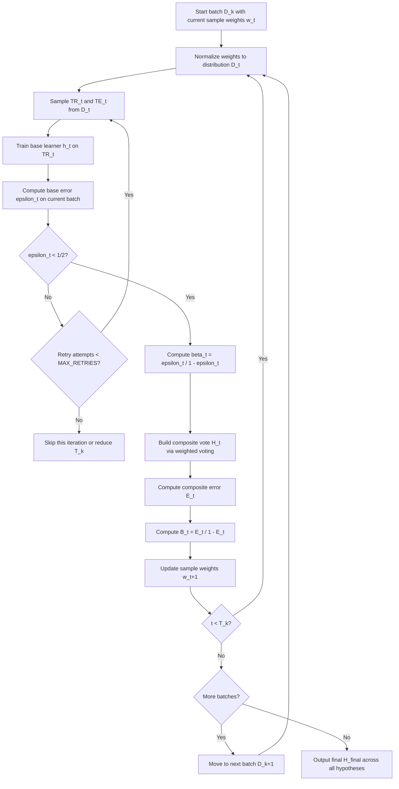

# Learn++ Algorithm and Equations

This file consolidates the Learn++ algorithm flow, all mathematical equations (Learn++ and per-classifier), worked numeric examples, and self-check exercises into a single reference.

---

## Table of Contents

1. [Notation](#notation)
2. [Learn++ Algorithm Flow](#learn-algorithm-flow)
3. [Learn++ Core Equations (Detailed)](#learn-core-equations-detailed)
4. [CompositeScore Equation (Selection Rule)](#compositescore-equation)
5. [Per-Classifier Equations](#per-classifier-equations)
6. [Worked Numeric Examples](#worked-numeric-examples)
7. [Self-Check Exercises](#self-check-exercises)
8. [Quick Reference: Minimum Equation Set](#quick-reference)

---

## Notation

| Symbol | Meaning | Type |
|--------|---------|------|
| $i$ | Sample index | integer, $1, \dots, m$ |
| $j$ | Feature index | integer, $1, \dots, d$ |
| $k$ | Batch/dataset index | integer, $1, \dots, K$ |
| $t$ | Learn++ iteration index within a batch | integer, $1, \dots, T_k$ |
| $m$ | Number of samples in current batch | integer |
| $d$ | Number of features | integer |
| $C$ | Number of classes | integer |
| $K$ | Number of incremental batches | integer |
| $T_k$ | Number of Learn++ iterations for batch $k$ | integer |
| $x_i$ | Feature vector of sample $i$ | $\mathbb{R}^d$ |
| $y_i$ | True label of sample $i$ | class ID in $\{1, \dots, C\}$ |
| $\hat{y}$ | Predicted class label | class ID |
| $Y$ | Set of all class labels | finite set |
| $h_t$ | Base hypothesis at iteration $t$ | classifier |
| $H_t$ | Composite hypothesis after $t$ iterations | ensemble |
| $D_t(i)$ | Normalized sample weight at iteration $t$ | probability |
| $w_t(i)$ | Unnormalized sample weight | positive real |
| $\mathbb{1}[\cdot]$ | Indicator function | 1 if true, 0 otherwise |

---

## Learn++ Algorithm Flow

### Mermaid Flowchart

### Step-by-Step Summary

| Step | Action | Equation |
|------|--------|----------|
| 1 | Normalize raw weights to distribution | $D_t(i) = w_t(i) / \sum_r w_t(r)$ |
| 2 | Train base learner on weighted sample draw | (base classifier's own training) |
| 3 | Compute base hypothesis error | $\epsilon_t$ |
| 4 | Check if $\epsilon_t < 0.5$; retry or skip if not | MAX_RETRIES guard |
| 5 | Convert error to vote-control term | $\beta_t = \epsilon_t / (1 - \epsilon_t)$ |
| 6 | Build composite vote | $H_t(x) = \arg\max_y \sum_j \mathbb{1}[h_j(x)=y] \log(1/\beta_j)$ |
| 7 | Compute composite error | $E_t$ |
| 8 | Normalize composite error | $B_t = E_t / (1 - E_t)$ |
| 9 | Update sample weights | Downweight correctly classified samples |
| 10 | Repeat for next iteration or next batch | Loop |
| 11 | Output final hypothesis | $H_{\text{final}}$ aggregates all batches |

---

## Learn++ Core Equations (Detailed)

### Eq. 1: Distribution Normalization

$$
D_t(i) = \frac{w_t(i)}{\sum_{r=1}^{m} w_t(r)}
$$

**Symbols**:
- $w_t(i)$: unnormalized weight of sample $i$ at iteration $t$
- $D_t(i)$: normalized probability-like weight
- $\sum_r w_t(r)$: total weight mass

**Plain meaning**: Convert raw weights into a valid distribution. Samples with higher $D_t(i)$ are emphasized more in the next base learner step.

**Why it matters**: Learn++ focuses on difficult samples by shifting distribution mass toward them.

---

### Eq. 2: Base Hypothesis Error

$$
\epsilon_t = \sum_{i:\, h_t(x_i) \neq y_i} D_t(i), \qquad 0 < \epsilon_t < \frac{1}{2}
$$

**Symbols**:
- $h_t(x_i)$: prediction of base learner at iteration $t$ for sample $i$
- $\epsilon_t$: weighted error of base hypothesis $h_t$

**Plain meaning**: Sum the weights of misclassified samples. High-weight misclassifications produce large $\epsilon_t$.

**Bound**: Learn++ expects a base learner better than random guessing. If $\epsilon_t \geq 0.5$, the hypothesis is rejected and resampled (up to MAX_RETRIES, typically 3–5 attempts). If retries are exhausted, skip the iteration or reduce $T_k$.

---

### Eq. 3: Normalized Hypothesis Error (Beta)

$$
\beta_t = \frac{\epsilon_t}{1 - \epsilon_t}, \qquad 0 < \beta_t < 1
$$

**Symbols**:
- $\epsilon_t$: weighted error from Eq. 2
- $\beta_t$: transformed error controlling voting strength

**Plain meaning**: Smaller $\epsilon_t$ → smaller $\beta_t$ → larger vote weight via $\log(1/\beta_t)$. Better base hypotheses contribute more to the ensemble.

---

### Eq. 4: Composite Vote

$$
H_t(x) = \arg\max_{y \in Y} \sum_{j=1}^{t} \mathbb{1}[h_j(x) = y] \log\!\left(\frac{1}{\beta_j}\right)
$$

**Symbols**:
- $H_t(x)$: composite prediction after combining hypotheses 1 through $t$
- $\log(1/\beta_j)$: vote weight for hypothesis $j$

**Plain meaning**: Each base model votes for one class. Better models get stronger vote weights. The class with the largest weighted vote wins.

**Why it matters**: This is where ensemble strength emerges from multiple base learners.

---

### Eq. 5: Composite Hypothesis Error

$$
E_t = \sum_{i=1}^{m} D_t(i)\,\mathbb{1}[H_t(x_i) \neq y_i]
$$

**Plain meaning**: Same idea as Eq. 2, but for the ensemble prediction, not a single base learner.

---

### Eq. 6: Composite Normalized Error

$$
B_t = \frac{E_t}{1 - E_t}
$$

**Plain meaning**: Converts composite error into the scaling factor for sample weight updates.

---

### Eq. 7: Weight Update Rule

$$
w_{t+1}(i) =
\begin{cases}
w_t(i) \cdot B_t, & \text{if } H_t(x_i) = y_i \\
w_t(i), & \text{if } H_t(x_i) \neq y_i
\end{cases}
$$

**Plain meaning**: Correctly classified samples have their weight reduced (multiplied by $B_t < 1$). Misclassified samples keep their weight unchanged. After normalization (Eq. 1), misclassified samples become relatively more important.

---

### Eq. 8: Final Hypothesis Across All Batches

$$
H_{\text{final}}(x) = \arg\max_{y \in Y} \sum_{k=1}^{K} \sum_{t=1}^{T_k} \mathbb{1}[h_t^{(k)}(x) = y] \log\!\left(\frac{1}{\beta_t^{(k)}}\right)
$$

**Symbols**:
- $k$: batch index
- $h_t^{(k)}$: hypothesis $t$ trained on batch $k$
- $\beta_t^{(k)}$: normalized error for that hypothesis

**Plain meaning**: Same weighted voting principle, aggregated across all batches seen over time.

**Why it matters**: Enables incremental learning without retraining on all old data.

---

## CompositeScore Equation

This equation ranks base learner candidates **after experiments complete**. It is NOT part of the Learn++ training loop.

$$
\text{CompositeScore} = 0.40 \cdot \text{MacroF1} + 0.15 \cdot \text{BalancedAccuracy} + 0.15 \cdot (1 - \text{TrainTimeNorm}) + 0.15 \cdot (1 - \text{InferenceTimeNorm}) + 0.15 \cdot (1 - \text{MemoryNorm})
$$

**Key distinction**:
- Learn++ equations (above) describe HOW the ensemble trains.
- CompositeScore describes HOW we COMPARE different base learners after experiments complete.

See [02_ARCHITECTURE.md](02_ARCHITECTURE.md) for weight rationale and normalization details.

---

## Per-Classifier Equations

These are the training equations used internally by each base learner candidate. Learn++ calls these at Step 2 of the flow.

### Decision Tree (simple)

**Impurity measures**:

$$
\text{Gini}(S) = 1 - \sum_{c=1}^{C} p(c \mid S)^2
$$

$$
\text{Entropy}(S) = -\sum_{c=1}^{C} p(c \mid S) \log_2 p(c \mid S)
$$

**Split criterion (information gain)**:

$$
\text{IG}(S, \text{split}) = I(S) - \sum_{v \in \text{children}} \frac{|S_v|}{|S|} I(S_v)
$$

---

### Gaussian Naive Bayes (simple)

**Class posterior**:

$$
P(y \mid x) \propto P(y) \prod_{j=1}^{d} \frac{1}{\sqrt{2\pi\sigma_{y,j}^2}} \exp\!\left(-\frac{(x_j - \mu_{y,j})^2}{2\sigma_{y,j}^2}\right)
$$

**Prediction**: $\hat{y} = \arg\max_y P(y \mid x)$

---

### Logistic Regression (simple)

**Binary form**:

$$
P(y=1 \mid x) = \sigma(w^T x + b) = \frac{1}{1 + e^{-(w^T x + b)}}
$$

**Cross-entropy loss**:

$$
\mathcal{L} = -\sum_{i=1}^{m} \left[ y_i \log \hat{p}_i + (1 - y_i) \log(1 - \hat{p}_i) \right]
$$

---

### Linear SVM / SGD Hinge (simple)

**Decision function**: $f(x) = w^T x + b$, $\hat{y} = \text{sign}(f(x))$

**Soft-margin objective**:

$$
\min_{w,b,\xi} \frac{1}{2}\|w\|^2 + C \sum_{i=1}^{m} \xi_i \quad \text{s.t. } y_i(w^T x_i + b) \geq 1 - \xi_i, \; \xi_i \geq 0
$$

---

### LDA (simple)

**Class discriminant function**:

$$
\delta_k(x) = x^T \Sigma^{-1} \mu_k - \frac{1}{2} \mu_k^T \Sigma^{-1} \mu_k + \log \pi_k
$$

**Prediction**: $\hat{y} = \arg\max_k \delta_k(x)$

---

### MLP (simple or complex, depending on size)

**Layer update**:

$$
h^{(\ell)} = \phi\!\left(W^{(\ell)} h^{(\ell-1)} + b^{(\ell)}\right)
$$

**Output and loss**:

$$
\hat{y} = \text{softmax}(W^{(L)} h^{(L-1)} + b^{(L)}), \qquad \mathcal{L} = -\sum_{i=1}^{m} \sum_{c=1}^{C} y_{ic} \log \hat{y}_{ic}
$$

---

### Random Forest (complex)

**Ensemble vote**: $\hat{y} = \text{mode}\{T_b(x)\}_{b=1}^{B}$

**Class probability**: $\hat{p}(c \mid x) = \frac{1}{B} \sum_{b=1}^{B} \mathbb{1}[T_b(x) = c]$

---

### RBF SVM (complex)

**Kernel**: $K(x, x') = \exp(-\gamma \|x - x'\|^2)$

**Decision function**: $f(x) = \sum_{i=1}^{m} \alpha_i y_i K(x_i, x) + b$

---

### Gradient Boosting Family (complex)

**Initialization**: $F_0(x) = \arg\min_\gamma \sum_{i=1}^{m} L(y_i, \gamma)$

**Pseudo-residuals at stage $s$**:

$$
r_{is} = -\left[\frac{\partial L(y_i, F(x_i))}{\partial F(x_i)}\right]_{F = F_{s-1}}
$$

**Additive update**: $F_s(x) = F_{s-1}(x) + \nu \cdot \rho_s \cdot h_s(x)$

---

### Feature-Encoder + Linear Head (complex)

**Representation and prediction**:

$$
z = f_\theta(x), \qquad \hat{y} = \text{softmax}(Wz + b)
$$

**Loss**: $\mathcal{L} = -\sum_{c=1}^{C} y_c \log \hat{y}_c$

---

## Worked Numeric Examples

### Example 1: Learn++ Error, Beta, Voting Weight, and Weight Update

**Setup**: One batch, 5 samples:

| $i$ | $D_t(i)$ | True label $y_i$ | Prediction $h_t(x_i)$ |
|-----|----------|------------------|----------------------|
| 1 | 0.10 | 1 | 0 |
| 2 | 0.20 | 0 | 0 |
| 3 | 0.15 | 1 | 0 |
| 4 | 0.25 | 0 | 0 |
| 5 | 0.30 | 1 | 1 |

Misclassified: samples 1 and 3.

**Step A — Base hypothesis error**:

$$
\epsilon_t = D_t(1) + D_t(3) = 0.10 + 0.15 = 0.25
$$

Acceptable because $0.25 < 0.5$.

**Step B — Normalized error**:

$$
\beta_t = \frac{0.25}{1 - 0.25} = \frac{0.25}{0.75} = 0.3333
$$

**Step C — Vote weight**:

$$
\log\!\left(\frac{1}{0.3333}\right) = \log(3) = 1.0986
$$

**Step D — Composite error and update factor** (assume $H_t$ misclassifies only sample 3):

$$
E_t = D_t(3) = 0.15, \qquad B_t = \frac{0.15}{0.85} = 0.1765
$$

**Step E — Weight update**:

| $i$ | Old $w_t(i)$ | $H_t$ correct? | New $w_{t+1}(i)$ |
|-----|-------------|-----------------|-------------------|
| 1 | 0.10 | Yes → ×0.1765 | 0.01765 |
| 2 | 0.20 | Yes → ×0.1765 | 0.03530 |
| 3 | 0.15 | No → unchanged | 0.15000 |
| 4 | 0.25 | Yes → ×0.1765 | 0.04413 |
| 5 | 0.30 | Yes → ×0.1765 | 0.05295 |

Sum ≈ 0.30003. After normalization:

| $i$ | $D_{t+1}(i)$ |
|-----|--------------|
| 1 | 0.0588 |
| 2 | 0.1176 |
| 3 | **0.4999** |
| 4 | 0.1471 |
| 5 | 0.1765 |

**Key insight**: Sample 3 now carries ~50% of the weight. The next base learner will focus heavily on it.

---

### Example 2: Gaussian Naive Bayes Posterior

**Setup**: Binary classes A and B, two features.

- Priors: $P(A) = 0.6$, $P(B) = 0.4$
- Class A: $\mu_{A1} = 2, \sigma_{A1}^2 = 1$; $\mu_{A2} = 1, \sigma_{A2}^2 = 1$
- Class B: $\mu_{B1} = 0, \sigma_{B1}^2 = 1$; $\mu_{B2} = 0, \sigma_{B2}^2 = 1$
- Query: $x = (1, 0)$

**Unnormalized scores**:

$$
\text{score}_A = 0.6 \times 0.2420 \times 0.2420 = 0.0351
$$

$$
\text{score}_B = 0.4 \times 0.2420 \times 0.3989 = 0.0386
$$

**Posterior**: Total = 0.0737

$$
P(A \mid x) = 0.0351 / 0.0737 = 0.476, \qquad P(B \mid x) = 0.524
$$

**Prediction**: Class B (higher posterior).

---

### Example 3: Linear SVM Decision and Hinge Loss

**Setup**: $w = (1.2, -0.8)$, $b = -0.3$, $C = 1$

| Sample | $x$ | $y$ | $f(x) = w^T x + b$ | Prediction | Hinge loss |
|--------|-----|-----|---------------------|------------|------------|
| a | (2, 1) | +1 | 1.3 | +1 ✓ | $\max(0, 1 - 1.3) = 0$ |
| b | (0.2, 1.8) | −1 | −1.5 | −1 ✓ | $\max(0, 1 - 1.5) = 0$ |
| c | (1, 1) | +1 | 0.1 | +1 ✓ (weak margin) | $\max(0, 1 - 0.1) = 0.9$ |

Regularizer: $\frac{1}{2}\|w\|^2 = \frac{1}{2}(1.44 + 0.64) = 1.04$

Objective: $1.04 + 0.9 = 1.94$

**Insight**: Even correctly classified points contribute training loss if they're inside the margin.

---

### Example 4: Gradient Boosting Stage Update (Squared Error)

**Setup**: Targets $y = [3, 5]$. Initialization: $F_0 = \text{mean} = 4$.

**Residuals**: $r_1 = 3 - 4 = -1$, $r_2 = 5 - 4 = +1$

Suppose base learner $h_1$ predicts $[-1, +1]$ exactly. With learning rate $\nu = 0.1$:

$$
F_1(x) = F_0(x) + 0.1 \cdot h_1(x)
$$

- Sample 1: $4 + 0.1(-1) = 3.9$ (moved toward 3)
- Sample 2: $4 + 0.1(+1) = 4.1$ (moved toward 5)

---

### Example 5: CompositeScore Calculation

| Metric | Value |
|--------|-------|
| MacroF1 | 0.76 |
| BalancedAccuracy | 0.80 |
| TrainTimeNorm | 0.25 |
| InferenceTimeNorm | 0.50 |
| MemoryNorm | 0.30 |

$$
\text{CompositeScore} = 0.40(0.76) + 0.15(0.80) + 0.15(1-0.25) + 0.15(1-0.50) + 0.15(1-0.30)
$$

$$
= 0.304 + 0.120 + 0.1125 + 0.075 + 0.105 = 0.7165
$$

---

## Self-Check Exercises

Try each exercise before checking the answer key below.

### Exercise 1: Learn++ Error and Beta

Given: $D_t = [0.12, 0.08, 0.30, 0.10, 0.40]$. Base hypothesis misclassifies samples 2 and 4.

1. Compute $\epsilon_t$.
2. Compute $\beta_t$.
3. Compute vote weight $\log(1/\beta_t)$.

### Exercise 2: Weight Update Direction

Given: $E_t = 0.2$.

1. Compute $B_t$.
2. Does a correctly classified sample's weight increase or decrease?
3. Does a misclassified sample's weight change?

### Exercise 3: Naive Bayes Quick Posterior

Binary classes A and B, equal priors. Unnormalized likelihoods: class A = 0.018, class B = 0.012.

1. Compute normalized posteriors.
2. Pick predicted class.

### Exercise 4: Hinge Loss

Given: $y = +1$, $f(x) = 0.4$.

1. Compute hinge loss.
2. Is this point inside, on, or outside the margin?

### Exercise 5: Boosting Update

Given: $F_0 = 10$, $h_1(x) = -2$, $\nu = 0.1$, $\rho_1 = 1$.

1. Compute $F_1(x)$.
2. Did prediction move up or down?

---

### Answer Key

**Exercise 1**: $\epsilon_t = 0.08 + 0.10 = 0.18$. $\beta_t = 0.18/0.82 = 0.2195$. Vote weight $= \log(4.556) \approx 1.516$.

**Exercise 2**: $B_t = 0.2/0.8 = 0.25$. Correctly classified: weight decreases (×0.25). Misclassified: weight unchanged.

**Exercise 3**: Total = 0.030. $P(A|x) = 0.60$, $P(B|x) = 0.40$. Predict A.

**Exercise 4**: Hinge $= \max(0, 1 - 0.4) = 0.6$. Point is inside the margin (correctly classified but $f(x) < 1$).

**Exercise 5**: $F_1 = 10 + 0.1(1)(-2) = 9.8$. Prediction moved down.

---

## Quick Reference

If time is limited, review these first:
1. **Learn++ core**: Equations 1–4 (distribution, error, beta, composite vote) and Eq. 7 (weight update).
2. **One equation per simple family**: Decision Tree impurity, Naive Bayes posterior, Linear SVM objective.
3. **One equation per complex family**: Random Forest vote, RBF kernel, Boosting additive update.
4. **CompositeScore** for final ranking only (not a training equation).
